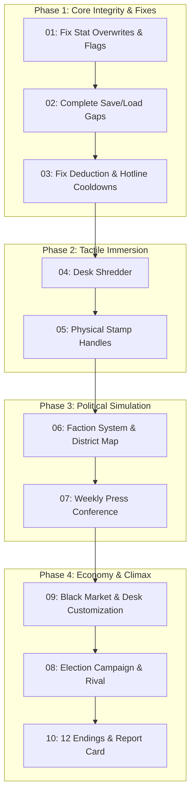

# "Yes, Mr. Mayor!" Architectural Enhancement Roadmap & Prompt Guide

## Executive Overview
Following an exhaustive codebase audit of **"Yes, Mr. Mayor!"** (Godot 4.7), this directory (`docs/`) contains a modular suite of **Bug Fix Specifications**, **Tactile Gameplay Enhancements**, and **Systemic Innovations**. 

Each document is authored in **Executable Prompt Language**—structured with context, technical root causes, target files, exact GDScript snippets, signal flows, edge cases, and automated test plans.

---

## Complete Documentation Index

| Phase | Spec File | Category | Primary Focus | Key Files Affected |
| :--- | :--- | :--- | :--- | :--- |
| **Phase 1** | [01_BUGFIX_RESOLUTION_EVENT_EFFECTS_AND_FLAGS.md](file:///c:/Users/User/Documents/yes-mr-mayor/docs/01_BUGFIX_RESOLUTION_EVENT_EFFECTS_AND_FLAGS.md) | **Critical Bug Fix** | Restores authored stats, visual flags (`city_visual_flag`), and consequence chains (`unlocks_event_id`) discarded in `_execute_stamping()`. | `DeskView.gd`, `GameManager.gd` |
| **Phase 1** | [02_BUGFIX_SAVELOAD_PERSISTENCE_GAPS.md](file:///c:/Users/User/Documents/yes-mr-mayor/docs/02_BUGFIX_SAVELOAD_PERSISTENCE_GAPS.md) | **Critical Bug Fix** | Serializes `hotline_history`, restores `DirectiveManager` on load, and preserves mid-shift clock, overtime, and focus state. | `SaveLoadManager.gd`, `DeskView.gd` |
| **Phase 1** | [03_BUGFIX_INSPECTION_TAG_MATCHING_AND_HOTLINE_COOLDOWNS.md](file:///c:/Users/User/Documents/yes-mr-mayor/docs/03_BUGFIX_INSPECTION_TAG_MATCHING_AND_HOTLINE_COOLDOWNS.md) | **Logic Fix** | Fixes 3-tag deduction bypass in `find_matching_violation()`, makes narrative text inspectable, and tracks unique hotline calls. | `EventData.gd`, `DocumentItem.gd`, `HotlineManager.gd` |
| **Phase 2** | [04_FEATURE_TACTILE_DESK_SHREDDER_AND_EVIDENCE_TAMPERING.md](file:///c:/Users/User/Documents/yes-mr-mayor/docs/04_FEATURE_TACTILE_DESK_SHREDDER_AND_EVIDENCE_TAMPERING.md) | **Tactile Gameplay** | Physical electric paper shredder prop to destroy incriminating documents or foil Federal Stings with risk of obstruction penalties. | `DeskShredder.gd`, `DeskView.gd`, `AudioManager.gd` |
| **Phase 2** | [05_FEATURE_PHYSICAL_STAMP_HANDLES_AND_INKING_MECHANICS.md](file:///c:/Users/User/Documents/yes-mr-mayor/docs/05_FEATURE_PHYSICAL_STAMP_HANDLES_AND_INKING_MECHANICS.md) | **Tactile Gameplay** | Physical 2.5D draggable rubber stamp handles with ink saturation, spring physics, angle jitter, ink smudges, and desk resonance. | `PhysicalStampHandle.gd`, `DocumentItem.gd` |
| **Phase 3** | [06_FEATURE_FACTION_INFLUENCE_AND_DISTRICT_MAP.md](file:///c:/Users/User/Documents/yes-mr-mayor/docs/06_FEATURE_FACTION_INFLUENCE_AND_DISTRICT_MAP.md) | **Political Systems** | 5 Municipal Factions (Oligarchs, Unions, Greens, Historic, Police) and an interactive fold-out architectural district blueprint map. | `FactionManager.gd`, `DistrictMapModal.gd`, `TopBarHUD.gd` |
| **Phase 3** | [07_FEATURE_WEEKLY_PRESS_CONFERENCE_MINIGAME.md](file:///c:/Users/User/Documents/yes-mr-mayor/docs/07_FEATURE_WEEKLY_PRESS_CONFERENCE_MINIGAME.md) | **Interactive Media** | Weekly Friday podium briefing minigame where reporters grill the Mayor on controversial decisions with 4 strategic response tactics. | `PressConferenceModal.gd`, `DeskView.gd`, `AudioManager.gd` |
| **Phase 4** | [08_FEATURE_MAYORAL_ELECTION_CAMPAIGN_AND_RIVAL_CANDIDATE.md](file:///c:/Users/User/Documents/yes-mr-mayor/docs/08_FEATURE_MAYORAL_ELECTION_CAMPAIGN_AND_RIVAL_CANDIDATE.md) | **Endgame Sprint** | Days 23-30 transformed into an election campaign against a named rival with live polling trackers, a Day 27 TV debate, and ballot tallies. | `ElectionManager.gd`, `TopBarHUD.gd`, `ElectionNightModal.gd` |
| **Phase 4** | [09_FEATURE_OFFICE_CUSTOMIZATION_AND_BLACK_MARKET_EXPANSION.md](file:///c:/Users/User/Documents/yes-mr-mayor/docs/09_FEATURE_OFFICE_CUSTOMIZATION_AND_BLACK_MARKET_EXPANSION.md) | **Economy & Meta** | Expands Offshore Ledger into a black market suite: Espresso Machine (+1 max focus), Dictaphone (blackmail), and Shell Corp dividends. | `OffshoreLedgerModal.gd`, `DeskView.gd`, `GameManager.gd` |
| **Phase 5** | [10_FEATURE_EXPANDED_ENDINGS_AND_MAYORAL_REPORT_CARD.md](file:///c:/Users/User/Documents/yes-mr-mayor/docs/10_FEATURE_EXPANDED_ENDINGS_AND_MAYORAL_REPORT_CARD.md) | **Narrative Climax** | 12 diverse endings with the "Mayoral Report Card", S-to-F civic performance letter grade, historical titles, and 10-year city epilogue. | `EndingsManager.gd`, `MayoralReportCardModal.gd` |

---

## Recommended Execution Order

Follow this strict phased progression to ensure architectural stability and prevent regressions:



---

## Prompt Execution Guide for Developers & AI Agents

When executing any document in this roadmap, apply the following standard workflow:

### Step 1: Ingest the Specification
Read the corresponding markdown file in `docs/` using `view_file` to review:
1. Target files and line numbers.
2. Replacement chunks or new class declarations.
3. Signal signatures and dictionary schemas.

### Step 2: Implement Code Changes
- For bug fixes (Docs 01–03), use `replace_file_content` to surgically replace flawed resolution math and serialization routines.
- For new features (Docs 04–10), create new components in `scenes/` and `scripts/`, then integrate their signals into `DeskView.gd` and `GameManager.gd`.
- Maintain strict i18n compliance by updating `data/localization.csv` with English, Turkish, and Spanish strings.

### Step 3: Headless Test Execution
After implementing any step, run the headless Godot test suite via command prompt to verify zero regressions:

```powershell
& 'C:\Program Files (x86)\Godot Engine\Godot_v4.7.2-stable_win64_console.exe' --headless --path . tests/TestRunnerMaster.tscn
```

To run a dedicated suite test:
```powershell
& 'C:\Program Files (x86)\Godot Engine\Godot_v4.7.2-stable_win64_console.exe' --headless --path . tests/TestRunnerMilestone3.tscn
```

### Step 4: Validate Visuals & Touchpoints
- Ensure all interactive desk elements have proper `focus_neighbor_*` chains for gamepad and keyboard navigation.
- Ensure audio triggers connect to `AudioManager.gd` procedural sound synthesis.
