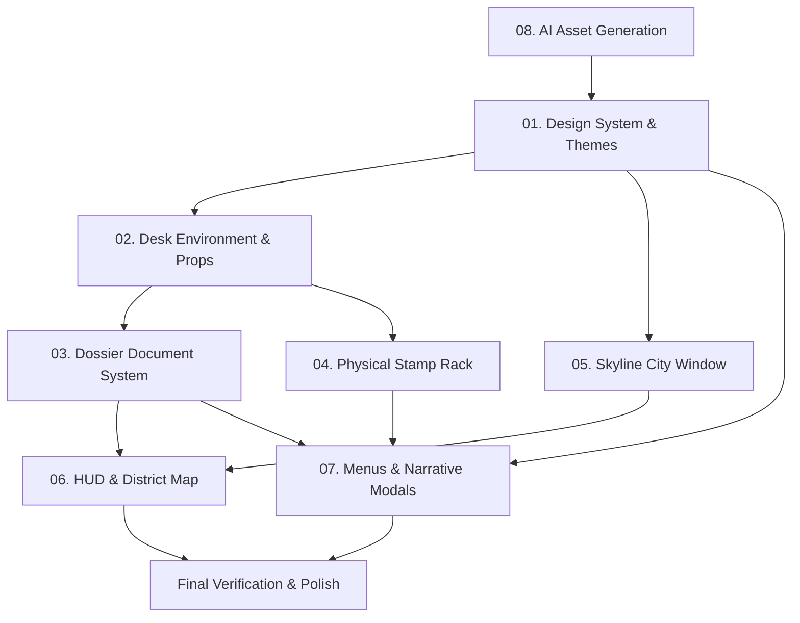

# "Yes, Mr. Mayor!" — Modernization & Visual Architecture Roadmap

## 1. Executive Purpose & Strategic Vision

"Yes, Mr. Mayor!" is a political-administrative simulation where players manage municipal crises, balance faction loyalties, pocket covert bribes, and decide the fate of a retro-modern metropolis from behind an executive desk. 

While the underlying gameplay architecture and procedural audio systems are feature-complete, the existing visual presentation relies almost exclusively on flat, solid-color `StyleBoxFlat` geometric panels and default fallback fonts. This creates an unfinished prototype appearance.

The documentation in this `docs/` directory provides an exhaustive, deterministic technical blueprint for transforming the game into an atmospheric, tactile, 2.5D retro-political thriller inspired by titles like *Papers, Please*, *Suzerain*, and *Disco Elysium*.

### Core Objectives:
1. **Physical Tactility**: Replace flat UI boxes with tangible desk props (rotary telephones, brass bells, industrial shredders, turned-wood rubber stamps).
2. **Atmospheric Immersion**: Introduce realistic materials (mahogany desk surfaces, leather blotters, fibrous parchment, tea stains, coffee rings, and typewriter ink).
3. **Forensic Depth**: Implement dynamic shaders for UV blacklight inspection, paper fiber ink absorption, magnifying glass distortion, and window rain streaks.
4. **Cinematic Worldbuilding**: Connect the player's desktop decisions directly to an exterior living metropolis via a multi-layer parallax skyline window with working clock towers and crisis-reactive landmarks.
5. **Harmonious Typography**: Eliminate system fallback fonts in favor of period-authentic typewriter, governmental serif, and clean grotesque typography.

---

## 2. Documentation Architecture & Module Directory

The modernization roadmap is decomposed into eight modular specifications:

| Module File | Domain / Subsystem | Primary Focus |
| :--- | :--- | :--- |
| [`01_design_system_and_themes.md`](file:///c:/Users/User/Documents/yes-mr-mayor/docs/01_design_system_and_themes.md) | Design System & Theming | Color tokens, typography, `.tres` resources, NinePatch slice conventions |
| [`02_desk_environment_and_props.md`](file:///c:/Users/User/Documents/yes-mr-mayor/docs/02_desk_environment_and_props.md) | Desk & Tactile Props | Mahogany desk, leather blotter, red rotary phone, bell, shredder, lamp lighting shader |
| [`03_dossier_document_system.md`](file:///c:/Users/User/Documents/yes-mr-mayor/docs/03_dossier_document_system.md) | Dossiers & Paperwork | Parchment textures, department seals, paperclips, UV blacklight & inspection shaders |
| [`04_physical_stamp_rack_and_tools.md`](file:///c:/Users/User/Documents/yes-mr-mayor/docs/04_physical_stamp_rack_and_tools.md) | Stamps & Inking Mechanics | Wooden stamp handles, cast-iron rack, drag elevation, impact squash, wet ink decal shader |
| [`05_skyline_city_window.md`](file:///c:/Users/User/Documents/yes-mr-mayor/docs/05_skyline_city_window.md) | Skyline & Weather Window | Parallax city layers, working clock tower, traffic streams, industrial smog, rain shader |
| [`06_hud_and_district_map.md`](file:///c:/Users/User/Documents/yes-mr-mayor/docs/06_hud_and_district_map.md) | HUD & District Map | Analog approval dials, rolling odometer currency, blueprint map, Twitch broadcast overlay |
| [`07_modals_menus_and_narrative.md`](file:///c:/Users/User/Documents/yes-mr-mayor/docs/07_modals_menus_and_narrative.md) | Menus & Narrative Modals | Cinematic main menu, morning newspaper, leather rulebook, offshore ledger, press conference |
| [`08_ai_asset_generation_specs.md`](file:///c:/Users/User/Documents/yes-mr-mayor/docs/08_ai_asset_generation_specs.md) | Asset Catalog & Pipeline | Exact prompts, resolutions, alpha cutout specs, Godot `.import` parameters |

---

## 3. Execution Sequence & Dependency Matrix

To ensure deterministic implementation without broken scene dependencies or missing asset references, AI agents must execute the modernization specifications in the following sequence:

### Detailed Phasing Roadmap

#### Phase 1: Asset Ingestion & Design Foundation (Prerequisites)
1. **Execute [`08_ai_asset_generation_specs.md`](file:///c:/Users/User/Documents/yes-mr-mayor/docs/08_ai_asset_generation_specs.md)**:
   - Generate all base textures, prop cutouts, seals, and panoramas into `assets/sprites/`.
   - Configure alpha channels and Godot `.import` flags (`Lossless` for UI, `Linear` filtering).
2. **Execute [`01_design_system_and_themes.md`](file:///c:/Users/User/Documents/yes-mr-mayor/docs/01_design_system_and_themes.md)**:
   - Install typography (`Inter`, `Cinzel`, `SpecialElite`) into `assets/fonts/`.
   - Construct `res://resources/themes/mayoral_theme.tres`.
   - Bind project-wide GUI theme in `project.godot`.

#### Phase 2: Primary Spatial Staging (Desk & Window)
3. **Execute [`02_desk_environment_and_props.md`](file:///c:/Users/User/Documents/yes-mr-mayor/docs/02_desk_environment_and_props.md)**:
   - Upgrade `DeskView.tscn` background from flat panels to textured mahogany wood and leather blotter.
   - Replace flat prop nodes (`RedTelephone.tscn`, `DeskShredder.tscn`, service bell) with interactive animated sprites.
   - Apply `desk_lighting.gdshader` for banker's lamp overhead spotlighting.
4. **Execute [`05_skyline_city_window.md`](file:///c:/Users/User/Documents/yes-mr-mayor/docs/05_skyline_city_window.md)**:
   - Convert `SkylineView.tscn` to multi-layer parallax depth system.
   - Synchronize clock tower hands with `DeskView.gd` shift minutes.
   - Integrate smog particles and `window_rain.gdshader`.

#### Phase 3: Core Gameplay Interaction (Paperwork & Stamping)
5. **Execute [`03_dossier_document_system.md`](file:///c:/Users/User/Documents/yes-mr-mayor/docs/03_dossier_document_system.md)**:
   - Refactor `DocumentItem.tscn` with NinePatch parchment bases, departmental crests, and metal paperclips.
   - Implement `uv_blacklight.gdshader` for forensic discrepancy inspection.
   - Add dynamic document drag inertia and lift shadow expansion.
6. **Execute [`04_physical_stamp_rack_and_tools.md`](file:///c:/Users/User/Documents/yes-mr-mayor/docs/04_physical_stamp_rack_and_tools.md)**:
   - Upgrade `PhysicalStampRack.tscn` and `PhysicalStampHandle.tscn` with 2.5D turned wood models and inking wells.
   - Implement drag elevation shadows, squash-and-stretch impact animations, and `stamp_ink_bleed.gdshader`.

#### Phase 4: Telemetry & District Exploration
7. **Execute [`06_hud_and_district_map.md`](file:///c:/Users/User/Documents/yes-mr-mayor/docs/06_hud_and_district_map.md)**:
   - Rebuild `TopBarHUD.tscn` with analog approval dials, rolling odometer currency, and pulsating suspicion tubes.
   - Overhaul `DistrictMapModal.tscn` into an interactive cyanotype blueprint with district crime and wealth heatmaps.
   - Modernize `CampaignTrackerHUD.tscn` and `TwitchVoteOverlay.tscn`.

#### Phase 5: Narrative Framing & Transitions
8. **Execute [`07_modals_menus_and_narrative.md`](file:///c:/Users/User/Documents/yes-mr-mayor/docs/07_modals_menus_and_narrative.md)**:
   - Overhaul `MainMenu.tscn` with cinematic high-rise office establishing backdrop.
   - Reconstruct `MorningBriefingCard.tscn` into a vintage morning broadsheet newspaper with `newspaper_halftone.gdshader`.
   - Upgrade `Rulebook.tscn` to an embossed leather-bound volume with animated tab navigation.
   - Style `OffshoreLedgerModal.tscn` and `PressConferenceModal.tscn`.

#### Phase 6: System-Wide Verification & Quality Assurance
- Conduct full gameplay shift verification from Day 1 Morning Ritual to Day 10 Election Night.
- Verify 60 FPS performance under Godot 4 `GL Compatibility` mode.
- Confirm zero visual regressions or layout clipping on 1920x1080 display.

---

## 4. Technical Constraints for Implementing Agents
1. **Never Break Signal Wiring**: Keep all `@onready` node bindings and unique name identifiers (`%BtnStampApprove`, `%RedTelephone`, `%DocumentDropZone`, etc.) intact when refactoring scenes.
2. **GL Compatibility Compliance**: Keep all custom shaders within CanvasItem GLES3/WebGL2 compatible specifications (avoid Vulkan compute shaders or advanced array uniform features not supported by Godot 4 Compatibility mode).
3. **Preserve Audio Integration**: Ensure all upgraded props (bell press, phone pickup, stamp slam, paper drag) preserve triggers to `AudioManager.gd` procedural sound effects.
4. **Resolution Independence**: Ensure all UI panels use NinePatchRect or proper Control anchoring (`anchors_preset`, `custom_minimum_size`) so layouts remain resilient across aspect ratios.
